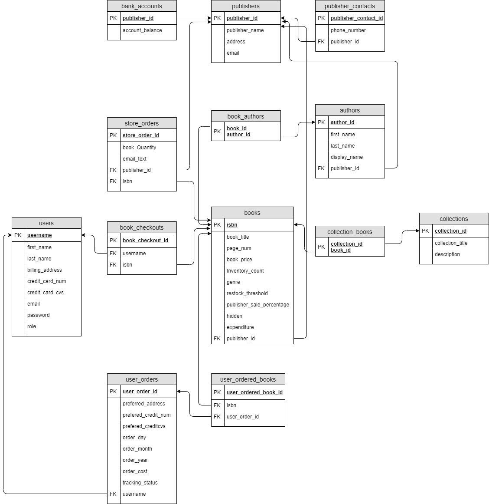

# COMP3005 - Bookstore Project

## Overview

## Prompt

Design and implement an application for an online bookstore (Look Inna Book). This application lets users
browse a collection of books that are available in the bookstore. A user can search the bookstore by book
name, author name, ISBN, genre, etc.. When a book is selected, information on the author(s), genre, publisher,
number of pages, price, etc. can be viewed. A user can select as many books as she likes to be added to
the checkout basket. A user needs to be registered in the bookstore to be able to checkout. When checking
out, the user inserts billing and shipping information (can be different than those used in registration), and
completes the order. The bookstore has the feature of tracking an order via an order number. A user can
use this order number to track where the order is currently. Although shipping is carried out by a third-party
shipping service, the online bookstore should have the tracking information available for when the user inquires
about an order using the order number. Assume all books are shipped from only one warehouse (no multiple
order numbers for multiple books shipped from multiple warehouses). The bookstore owners can add new books
to their collections, or remove books from their store. They also need to store information on the publishers
of books such as name, address, email address, phone number(s), banking account. The banking account for
publishers is used to transfer a percentage of the sales of books published by these publishers. This percentage
is variable and changes from one book to another. The owners should have access to reports that show sales
vs. expenditures, sales per genres, sales per author, etc.. The application should also be able to automatically
place orders for new books if the remaining quantity is less than a given threshold (e.g., 10 books). This is done
by sending an email to the publisher of the limited books to order a number of books equal to how many books
were sold in the previous month (you do not have to implement the email sending component).

## Schema

